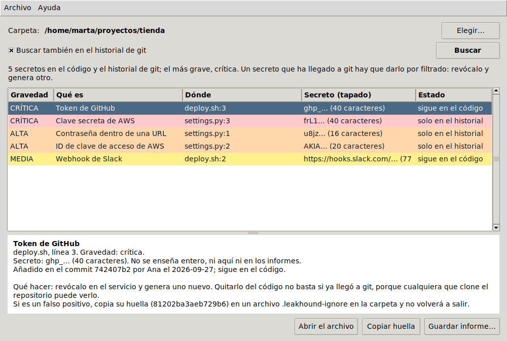

# leakhound

[](https://github.com/espi0207/leakhound/actions/workflows/ci.yml)
[](https://github.com/espi0207/leakhound/actions/workflows/release.yml)

Busca contraseñas, claves de API, tokens y claves privadas que se han colado en el
código, y sobre todo en el **historial de git**. Tiene ventana para usarlo a mano, y en
la terminal funciona también como hook pre-commit para que no se cuele nada, o en
GitHub Actions para que los hallazgos salgan en la pestaña Security del repositorio.

Es Python sin dependencias.



## Descargar

| Sistema | |
|---|---|
| **Windows** 10 y 11 | [Instalador (leakhound-windows.exe)](https://github.com/espi0207/leakhound/releases/latest/download/leakhound-windows.exe) |
| **macOS** 11 o posterior, con chip de Apple | [leakhound-mac.dmg](https://github.com/espi0207/leakhound/releases/latest/download/leakhound-mac.dmg) |
| **Linux** (Ubuntu, Debian, Mint...) | [leakhound-linux.deb](https://github.com/espi0207/leakhound/releases/latest/download/leakhound-linux.deb) |

No están firmados, porque firmar cuesta dinero cada año. Por eso la primera vez el
sistema avisa:

- **Windows** dice "Windows protegió su PC". Pulsa *Más información* y luego *Ejecutar
  de todas formas*. El instalador puede añadir **Buscar secretos con leakhound** al
  menú del clic derecho de las carpetas (en Windows 11, dentro de *Mostrar más
  opciones*). Para buscar en el historial hace falta tener
  [git](https://git-scm.com/download/win).
- **macOS**: arrastra leakhound a Aplicaciones y ábrelo. Dirá que no puede comprobar si
  es seguro; ve a *Ajustes del Sistema > Privacidad y seguridad*, baja hasta el aviso
  de leakhound y pulsa *Abrir igualmente*. Solo hace falta una vez.
- **Linux**: `sudo apt install ./leakhound-linux.deb`. Instala también la versión de
  terminal (`leakhound`).

Para verlo funcionar: *Archivo > Probar con un repositorio de ejemplo* crea un
repositorio en el que alguien sube unas claves y las "borra" en el commit siguiente.

Los tres se construyen y se prueban en GitHub Actions: la CI instala cada uno, lo abre
con el ejemplo y comprueba que encuentra lo que tiene que encontrar.

## Por qué el historial

El error típico: alguien sube un archivo con la contraseña de la base de datos, se da
cuenta, la cambia por una variable de entorno y hace commit. El código queda limpio,
pero la contraseña sigue en el commit anterior, y cualquiera que clone el repo la ve
con `git log -p`. En un repo público hay bots que buscan exactamente eso a los pocos
minutos de un push.

`leakhound history` lee todo el historial, de todas las ramas, y dice en qué commit
entró cada secreto y si sigue en el código o ya "se borró".

## Instalación (para la terminal)

Python 3.10 o superior y git.

```bash
git clone https://github.com/espi0207/leakhound.git
cd leakhound
python -m venv .venv
source .venv/bin/activate        # en Windows: .venv\Scripts\activate
pip install -e .
```

## Probarlo

```bash
leakhound demo
```

Crea un repositorio temporal en el que alguien sube credenciales, las "borra" en otro
commit y más tarde sube un script con un token. Luego escanea el código actual y el
historial. Lo del historial:

```text
[CRÍTICA] Token de GitHub  deploy.sh:3
          ghp_… (40 caracteres)  huella 81202ba3aeb729b6
          añadido en 50377b15 por Ana el 2026-09-26; sigue en el código

[CRÍTICA] Clave secreta de AWS  settings.py:3
          frL1… (40 caracteres)  huella 46b9521b318d38b3
          añadido en 72854ab8 por Ana el 2026-09-26; ya no está en el código, pero sí en el historial

[ALTA]    Contraseña dentro de una URL  settings.py:1
          u8jz… (16 caracteres)  huella 5cb1c4cf6901a712
          añadido en 72854ab8 por Ana el 2026-09-26; ya no está en el código, pero sí en el historial
...
```

Los secretos nunca se imprimen enteros, ni en el texto ni en el JSON ni en el SARIF.
Un informe de seguridad no debería filtrar lo mismo que busca.

## Uso

```bash
leakhound scan                      # el directorio actual
leakhound scan src/ config/.env     # archivos o carpetas concretas
leakhound history                   # todo el historial del repo en el que estás
leakhound rules                     # lista de reglas
```

`--format json` o `--format sarif` cambian la salida, y `-o archivo` la guarda. Sale
con código 1 si encuentra algo, 0 si no y 2 si hay un error.

### Como hook pre-commit

```bash
leakhound hook install
```

Desde ese momento, cada `git commit` revisa lo que vas a subir y lo cancela si hay un
secreto. Si es un falso positivo, lo explica al cancelar: se puede ignorar esa línea o
saltarse la comprobación una vez con `git commit --no-verify`. `leakhound hook
uninstall` lo quita (y nunca toca un hook que no haya puesto él).

### En GitHub Actions

Con este workflow los hallazgos aparecen en la pestaña **Security > Code scanning**
del repositorio, marcados en la línea exacta:

```yaml
name: Secretos
on: [push, pull_request]

jobs:
  leakhound:
    runs-on: ubuntu-latest
    permissions:
      contents: read
      security-events: write   # para poder subir el SARIF
    steps:
      - uses: actions/checkout@v5
        with:
          fetch-depth: 0       # sin esto solo se descarga el último commit
      - uses: actions/setup-python@v6
        with:
          python-version: "3.12"
      - run: pip install git+https://github.com/espi0207/leakhound
      - run: leakhound history . --format sarif -o leakhound.sarif
        continue-on-error: true
      - uses: github/codeql-action/upload-sarif@v4
        with:
          sarif_file: leakhound.sarif
```

### Ignorar falsos positivos

- En la propia línea: un comentario con `leakhound:ignore`.
- En un archivo `.leakhound-ignore` en la raíz del repo, con la huella que sale en cada
  hallazgo o con rutas:

```text
# token de ejemplo de la documentación, ya revocado
81202ba3aeb729b6
tests/fixtures/*
```

## Qué busca

Formatos concretos, que casi nunca fallan: claves privadas (RSA, EC, OpenSSH, PGP),
claves de AWS, tokens de GitHub, GitLab, Slack, npm y PyPI, webhooks de Slack y
Discord, tokens de bots de Telegram, claves de Stripe, Google, SendGrid, OpenAI y
Anthropic, y JWT.

Y dos reglas genéricas: contraseñas dentro de URLs (`postgres://app:xxx@db/...`) y
asignaciones del tipo `DB_PASSWORD = "..."`. Estas son las difíciles, porque una
regla así salta con cualquier cosa. Para que no lo haga:

- El valor tiene que parecer aleatorio (entropía de Shannon alta). `"contraseña123"` no
  lo parece; un token, sí.
- Se descartan los valores de ejemplo (`changeme`, `your-token`, `XXXX`), las
  plantillas (`{password}`, `${DB_PASS}`, `{{ secrets.X }}`) y los nombres de variable
  (`"?InterpolationInTemplate"`).
- Si el valor está en base64, se descodifica: `Zm9vYmFyOmZvb2Jhcg==` es
  `foobar:foobar` y no merece un aviso. `YWRtaW46...` con una contraseña de verdad
  dentro, sí.
- Los valores sin comillas solo cuentan en archivos de configuración (`.env`, `.yml`,
  `.ini`...). En código, `token = request.headers` es una variable, no un secreto.

Cada uno de esos filtros salió de probarlo contra código real. Sobre unos 10.000
archivos de dependencias de npm y de la biblioteca estándar de Python, la primera
versión daba 22 avisos. La actual da uno, y tiene toda la pinta de ser de verdad: un
token de Coveralls que se quedó dentro de un paquete de npm muy usado.

## Si encuentras un secreto

Hay que darlo por filtrado. Lo primero es revocarlo en el servicio y generar uno nuevo;
reescribir el historial (con `git filter-repo`) viene después, y si el repo ya era
público no arregla nada: puede haber copias en cualquier parte.

## Limitaciones

- No comprueba si un secreto sigue activo: eso exigiría usarlo contra el servicio, y un
  escáner no debería hacer peticiones con credenciales que no son suyas.
- Las reglas genéricas se pueden equivocar hacia los dos lados. Una contraseña corta o
  hecha de palabras normales no se detecta.
- Solo lee archivos de texto de menos de 2 MB y no entra en `node_modules`, `.venv` y
  similares.

## Pruebas

```bash
pip install -e ".[dev]"
pytest
```

Los secretos de las pruebas y de la demo se generan al ejecutarse, montados por
partes: en el código fuente no hay ninguno completo. Si lo hubiera, el propio GitHub
podría bloquear el push, y la CI de este repo, que pasa leakhound por su propio
historial, fallaría.

La ventana (`leakhound/gui.py`) usa Tkinter, que viene con Python, y hace el trabajo
lento en otro hilo para no quedarse congelada. Los instaladores los construye
[`release.yml`](.github/workflows/release.yml) en una máquina de cada sistema:
PyInstaller e Inno Setup para Windows, PyInstaller para la app de macOS y un `.deb` que
usa el Python del sistema para Linux. Con cada cambio se construyen y se prueban. Para
publicarlos en Releases basta con *Actions > Instaladores > Run workflow* marcando
*Publicar* (o subir una etiqueta: `git tag v1.1.0 && git push --tags`).

## Licencia

[MIT](LICENSE)
